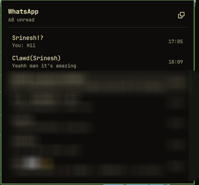

# WhatsApp for Omarchy

> **Note**: This repository is an enhanced fork of [`srineshr1/omarchy-whatsapp`](https://github.com/srineshr1/omarchy-whatsapp) maintained by [ahasdemir](https://github.com/ahasdemir).

WhatsApp integration for [Omarchy](https://omarchy.org/): available both as an **Omarchy Quattro bar widget** (unread badge, desktop notifications, inline reply, bar dropdown) and as a **standalone native desktop application window** (`omarchy-whatsapp app`).

<p align="center">
  
  
</p>

---

## Key Features & Fork Differences

Compared to the upstream repository (`srineshr1/omarchy-whatsapp`), this fork (`ahasdemir/omarchy-whatsapp`) includes major additions and architectural enhancements:

* 📱 **Standalone Desktop Application Window (`AppWindow.qml`)**:
  Launch WhatsApp as a full-fledged native desktop app window via `omarchy-whatsapp app` or `omarchy-whatsapp-app`. Features live Omarchy OS theme synchronization (`colors.toml` / `shell.toml` theme watchers), collapsible sidebar navigation (*All Chats*, *Unread*, *Favorites*), and quick search.
* 📜 **Scroll-to-Top Message Pagination**:
  Scroll up in any chat to dynamically fetch and load older historical messages on demand.
* 🔍 **Search, Favorites & Quick Compose**:
  Filter conversations with instant search, star favorite contacts, and compose quick messages from the sidebar or panel header.
* 🖼️ **Full-Screen Desktop Image Peek**:
  Click any image attachment to expand it into a full desktop modal preview overlay.
* 🔗 **Clickable Web URLs**:
  URLs inside message bodies are rendered as clickable links with hover pointer feedback.
* 🔄 **Bi-Directional Read Status & 'Mark as Unread' Sync**:
  Synchronizes read receipts and 'Mark as Unread' state seamlessly between your phone, the local daemon, and linked devices.
* 📇 **Address Book Contact Name Priority**:
  Prioritizes phone address book contact names over generic WhatsApp push names for better contact identification.
* ⚡ **Optimized Media Downloading Queue**:
  Increased parallel download queues with automatic download prioritization for the currently active chat.
* 🛠️ **JID Alias Unification & Business/Bot Support**:
  Unified chat histories across aliased JIDs (resolving WhatsApp LID vs Phone Number JIDs) and clean support for business/bot messages.

---

## How It Works

The architecture consists of two decoupled layers communicating over a local Unix domain socket:

| Component | Technology | Purpose |
|-----------|------------|---------|
| **Bridge Daemon** | Node.js + [Baileys](https://github.com/WhiskeySockets/Baileys) | Maintains linked-device session, receives messages, handles media queues, dispatches desktop notifications, and executes actions. |
| **Frontend Clients** | QML / Qt Quick (Quickshell) | **Bar Widget (`BarWidget.qml` & `Panel.qml`)** for bar dropdowns/inline replies, and **Standalone App (`AppWindow.qml`)** for a full window view. |

They communicate via NDJSON over `$XDG_RUNTIME_DIR/omarchy-whatsapp.sock`. The daemon acts as a fan-out hub so multiple bars or application windows stay synchronized seamlessly without running background browsers.

---

## Installation

### Method 1: Omarchy Plugin Manager (Recommended)

```sh
omarchy plugin add https://github.com/ahasdemir/omarchy-whatsapp.git --enable --yes
```

Upon first launch, the plugin automatically installs Node dependencies, registers the `omarchy-whatsapp` user service, and creates CLI symlinks in `~/.local/bin`.

### Method 2: From Source Checkout

```sh
git clone https://github.com/ahasdemir/omarchy-whatsapp.git
cd omarchy-whatsapp
./install.sh
```

### Requirements
* **Omarchy 4 (Quattro)**
* **Node.js 20+** (if using `mise`, `proto`, `fnm`, `nvm`, or `volta`, the setup script auto-detects and pins your Node path in the systemd service).

---

## Linking Your Account

Click the WhatsApp icon in the bar or launch the app and scan the QR code. Alternatively, link via CLI:

```sh
omarchy-whatsapp login                        # Display QR code in terminal
omarchy-whatsapp login --pair 919812345678    # Pair using an 8-digit code
```

On your phone: **Settings → Linked devices → Link a device**.

*Note: The QR code refreshes automatically every ~20 seconds. If left unscanned for 5 minutes, pairing pauses automatically to conserve system resources. Click "Show QR code" or run `omarchy-whatsapp login` to resume.*

---

## Usage & Interface Options

### 1. Standalone Application Window
To run WhatsApp as a full-screen or floating application window:

```sh
omarchy-whatsapp app
# or directly:
omarchy-whatsapp-app
```

### 2. Bar Panel & Keyboard Navigation

| Action | Control / Shortcut |
|--------|-------------------|
| Open Bar Panel | Left-click the bar icon |
| Standalone App Window | Right-click the bar icon or run `omarchy-whatsapp app` |
| Move through chats | `j` / `k` or Arrow Keys |
| Select / Open chat | `Enter` |
| Search chats / contacts | Magnifying-glass icon or `/` |
| Toggle Unread filter | Filter button on chat list |
| Load older messages | Scroll up to top of chat list |
| Favorite a chat | Star icon on hover or header |
| Click links | Left-click any URL in message body |
| Image preview peek | Left-click image attachment thumbnail |
| Send reply | Type message and press `Enter` |
| Close panel | `Escape` |

---

## CLI Reference

```sh
omarchy-whatsapp status                         # Connection state, account info, unread counts
omarchy-whatsapp app                            # Launch standalone QML app window
omarchy-whatsapp send 919812345678@s.whatsapp.net "On my way"
omarchy-whatsapp chats 10                       # List recent chats as JSON
omarchy-whatsapp focus 919812345678@s.whatsapp.net  # Focus bar panel/window on specific chat
omarchy-whatsapp open                           # Open full WhatsApp Web client in browser
omarchy-whatsapp restart                        # Restart background daemon service
omarchy-whatsapp logs                           # View live daemon logs
omarchy-whatsapp logout                         # Unlink device and purge session state
omarchy-whatsapp uninstall                      # Remove systemd service, CLI links & credentials
```

---

## Configuration & Settings

Per-widget settings live in `~/.config/omarchy/shell.json` under your bar entries and hot-reload on save:

```json
{
  "id": "io.github.ricky.whatsapp",
  "showUnreadCount": true,
  "chatLimit": 40
}
```

| Key | Default | Description |
|-----|---------|-------------|
| `socketPath` | `""` | Socket path (blank defaults to `$XDG_RUNTIME_DIR/omarchy-whatsapp.sock`) |
| `autostartDaemon` | `true` | Automatically launch the daemon if not running |
| `showUnreadCount` | `true` | Display unread counter badge next to the bar icon |
| `hideWhenEmpty` | `false` | Hide bar widget completely when there are 0 unread messages |
| `chatLimit` | `40` | Maximum chats listed in panel |
| `messageLimit` | `60` | Initial messages loaded per conversation |
| `webAppUrl` | `https://web.whatsapp.com` | WhatsApp Web fallback URL |

Position the bar widget using standard Omarchy commands:

```sh
omarchy bar move io.github.ricky.whatsapp --section right
```

---

## Data Storage & Privacy

| Location | Contents |
|----------|----------|
| `~/.local/state/omarchy-whatsapp/auth/` | Linked device credentials and Signal protocol keys (`0700`) |
| `~/.local/state/omarchy-whatsapp/store.json` | Local chat cache & message history (`0600`) |
| `~/.local/state/omarchy-whatsapp/media/` | Downloaded image & media cache (`0700`) |
| `$XDG_RUNTIME_DIR/omarchy-whatsapp.sock` | Local control socket (`0600`) |

All data stays strictly on your local machine. No external servers are involved except direct encrypted traffic to WhatsApp's infrastructure.

To clear all stored session data:

```sh
omarchy-whatsapp logout
```

---

## Troubleshooting

- **Daemon Offline / Dim Icon**:
  ```sh
  systemctl --user status omarchy-whatsapp
  journalctl --user -u omarchy-whatsapp -n 50
  ```
- **Node.js Path Issue**: If using a custom Node path, configure the service:
  ```sh
  systemctl --user edit omarchy-whatsapp
  # Add: Environment=OMARCHY_WHATSAPP_NODE=/path/to/node
  ```
- **Widget Missing in Bar**:
  ```sh
  omarchy plugin list --json | jq '.[] | select(.id == "io.github.ricky.whatsapp")'
  omarchy restart shell
  ```

---

## Uninstallation

```sh
omarchy plugin remove io.github.ricky.whatsapp
# or from source checkout:
./install.sh --uninstall
```

---

## License

MIT. See [LICENSE](LICENSE).
